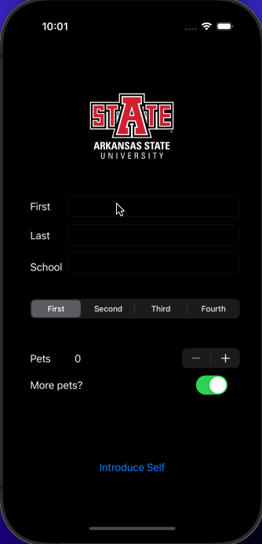

# codepath--prework

# IntroduceStudent App

## App Description
TODO:// The IntroduceStudent app is a user-friendly iOS application designed to facilitate self-introduction by capturing and presenting key information about the user. With an intuitive interface, users can input details such as their first and last names, school name, academic year, and even express their preference for having more pets.

## App Walk-Through

## Features

### Required Features
- [x] App displays an image of a school's logo
- [x] App has three textfields for first, last, and school names
- [x] App has a segmented control that changes student year
- [x] Number of pet matches label is increased/decreased by stepper
- [x] Switch makes a statement about wanting more pets or not (true/false)
- [x] Introduce yourself button shows an alert box with an introduction and dismiss button

### Optional Features
- [ ] User can tap a button to change the color of the background view
- [ ] User can select additional buttons that provide more info about the user. Example: more textfields, a different alert box, etc.
- [ ] Any stylistic changes that are not default options (Comment this here)
